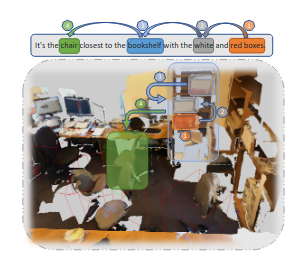
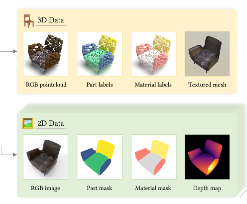

I am currently pursuing a Master’s degree at the University of Alberta under the supervision of Professor [Marlos C. Machado](https://webdocs.cs.ualberta.ca/~machado/). My research focuses on Reinforcement Learning (RL), with a particular interest in addressing the plasticity challenge in continual RL.

Previously, I conducted a research internship on 3D Computer Vision, specifically composition learning, at King Abdullah University of Science and Technology (KAUST) under the supervision of Prof.[Mohamed Elhoseiny](https://cemse.kaust.edu.sa/people/person/mohamed-elhoseiny). Also, I worked at data distillation of NLP datasets as an intern at Microsoft Research. During my undergraduate program, I focused on optimizing Approximate Nearest Neighbor Search for billion-scale NLP datasets and supporting filter-search.

**Current Interests**: Machine Learning, Reinforcement Learning, Continual Learning, Computer Vision, Search Optimization, and Games.  
 

Publications
======

{: .align-left width="300px"}
  
**COT3DREF: Chain-of-Thoughts Data-Efficient 3D Visual Grounding**  
Eslam Mohamed Bakr, **Mohamed Ayman**, Mahmoud Ahmed, Habib Slim, Mohamed Elhoseiny
 
Presented at the International Conference on Learning Representations (ICLR), 2024
 
[PDF](https://arxiv.org/pdf/2310.06214) | [Code](https://github.com/eslambakr/CoT3D_VG)

  
{: .align-left width="300px"}
 
**3DCoMPaT++: An improved large-scale 3D vision dataset for compositional recognition**  
Habib Slim, Xiang Li, Yuchen Li, Mahmoud Ahmed, **Mohamed Ayman**, Ujjwal Upadhyay,
Ahmed Abdelreheem, Arpit Prajapati, Suhail Pothigara, Peter Wonka
 
Submitted at Transactions on Pattern Analysis and Machine Intelligence (TPAMI), 2024
 
[PDF](https://arxiv.org/pdf/2310.18511) | [Code](https://arxiv.org/pdf/2310.18511)

